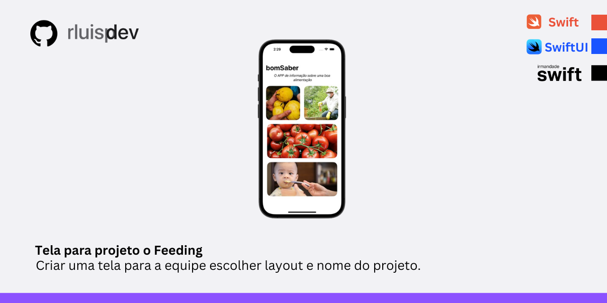

# Interface "bomSaber"

## 🚀 Desafio do Projeto.

Este projeto foi criado para servir de uma das 04 opções que a equipe de criação do projeto Feeding concordou em criar, individualmente para escolha.

- Modificadores básicos
- Texto e fonte
- Imagens  
- HStacks e VStacks
- Implantação no iPhone

## ✔️ Técnicas e Tecnologias Utilizadas

- Linguagem de Programação: Swift
- Framework: SwiftUI
- IDE: Xcode
- Controle de Versão: Git

## 💻 Como Executar o Projeto

1. Clone este repositório.
2. Abra o projeto no Xcode.
3. Explore e execute o projeto no simulador do iPhone ou em um dispositivo físico.

## Quem é IrmandadeSwift ?
- Michel Lopes 

 >   _Michel Lopes é um desenvolvedor iOS com mais de 13 anos de experiência e já criou produtos que atingiram mais de 2 milhões de pessoas. Aos 26 anos, se tornou professor universitário
 no curso de Ciência da computação em uma das maiores Universidades do país, e nos últimos 8 anos, atuou com a Apple treinando centenas de pessoas no maior projeto de capacitação em iOS 
do mundo, a Apple Developer Academy._

  > _Em 2022, Michel fundou a Irmandade Swift, um grupo de desenvolvedores iOS com o objetivo de apoiar brasileiros através do compartilhamento de conteúdos gratuitos e simplificados, além
 de capacitar pessoas através de uma experiência única. Atualmente, a Irmandade cresceu e conta com a participação de vários desenvolvedores que compartilham desse mesmo sentimento, e
 contribuem ativamente para o crescimento e evolução desse ambiente._  
 
- [IrmandadeSwifit.com](https://www.irmandadeswift.com/sobre)
-  [YouTube](www.youtube.com/@irmandadeSwift)
-  [Instagram](https://www.instagram.com/irmandadeswift/)

## 👨‍💻 Student

    
    
&nbsp&nbsp&nbsprluispdev 
    &nbsp&nbsp&nbsp
    <a href="https://github.com/rluispdev">
    GitHub</a>&nbsp;|&nbsp;
     <a href="https://cursos.alura.com.br/user/rluisp"> Alura Profile</a>
&nbsp;|&nbsp;
    <a href="https://www.linkedin.com/in/rafael-luis-gonzaga-b11634186/">LinkedIn</a>
&nbsp;|&nbsp;
    <a href="https://www.instagram.com/rluispdevs?igsh=cnoxenpmaHY1amE0&utm_source=qr">
    Instagram</a>
&nbsp;|&nbsp;

  

